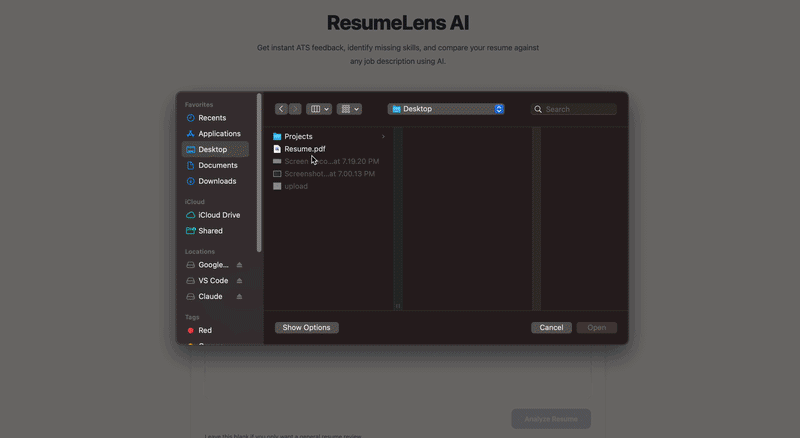

# ResumeLens

An AI-powered resume reviewer that helps job seekers improve their resumes, understand ATS compatibility, and identify gaps between their resume and a job description.



---

## Features

### Resume Analysis
- Upload PDF and DOCX resumes
- Automatic resume parsing
- ATS score
- Strengths and weaknesses
- Actionable recommendations
- Section-by-section feedback

### Job Match Analysis
- Paste a job description
- Resume-to-job match score
- Missing keywords
- Missing skills
- Experience gap analysis
- Top improvement suggestions

### Modern UI
- Responsive interface
- Drag-and-drop resume upload
- Loading animations
- Clean dashboard
- Interactive analysis cards

---

## Tech Stack

### Frontend
- React
- TypeScript
- Vite
- Tailwind CSS
- Framer Motion

### Backend
- Node.js
- Express
- OpenAI API

### Resume Parsing
- pdfjs-dist
- Mammoth (DOCX)

### AI Concepts Implemented
- LLM API integration
- Prompt engineering
- Structured LLM outputs
- Constrained generation
- Zod-based AI output validation
- AI-powered document analysis
- Typed AI → application data pipeline
- AI-driven prioritization
- Single-document LLM reasoning
---

## Project Structure

```
ResumeLens
│
├── api/
├── demo/
├── public/
├── src/
│   ├── components/
│   ├── pages/
│   ├── server/
│   ├── types/
│   └── utils/
│
├── package.json
└── README.md
```

---

## Getting Started

### 1. Clone the repository

```bash
https://github.com/VanshikaSingh/ResumeLens.git
cd resume-reviewer
```

### 2. Install frontend dependencies

```bash
npm install
```

### 3. Install backend dependencies

```bash
cd src/server
npm install
cd ../..
```

---

## Environment Variables

Create:

```
src/server/.env
```

Add your OpenAI API key:

```env
OPENAI_API_KEY=your_api_key_here
```

---

## Run the Frontend

```bash
npm run dev
```

Runs on:

```
http://localhost:5173
```

---

## Run the Backend

Open a second terminal:

```bash
cd src/server
npm start
```

Runs on:

```
http://localhost:3000
```

---


## License

MIT
